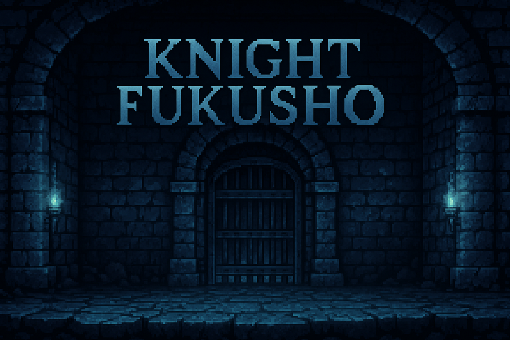

> *"The chains that bound me have become the weapons of my vengeance..."*

A 2D action-packed dungeon crawler game built in Unity where players take on the role of a betrayed knight seeking freedom, revenge, and the truth behind their imprisonment.

## 🧱 Game Overview

**Knight Fukusho** follows the dark journey of a once-noble knight who was betrayed by those he trusted and imprisoned in the depths of a forgotten dungeon. As torches flicker against damp stone walls and the distant screams of other prisoners fade into silence, our hero's resolve only strengthens.

Driven by burning hatred and an unwavering desire for freedom, he finally breaks his chains after years of confinement. Now, with nothing but his skill and fury, he battles the twisted creatures and corrupted guards that haunt the labyrinthine halls of his living nightmare.

With each enemy slain and each new area discovered, fragments of the truth begin to surface. Who orchestrated this betrayal? What dark purpose does this dungeon truly serve? And is what waits beyond these walls truly freedom—or something far more sinister?

## 🎮 How to Play

### 🎛️ Controls

* **W, A, S, D**: Move through shadow-filled corridors and chambers
* **J**: Strike with fury and precision
* **K**: Raise your guard against the onslaught of enemies
* **Space**: Leap across chasms and deadly traps
* **E**: Interact with ancient mechanisms, mysterious artifacts, and sealed doors
* Type **ILOVEYOU** on your **keyboard** to active Cheat Code which give you all Items Buff

### ⚙️ Gameplay Mechanics

* Battle relentless waves of nightmarish creatures that guard the secrets of the dungeon
* Execute devastating combo attacks that grow more powerful as you progress
* Discover hidden chambers containing fragments of your forgotten past
* Collect ancient coins to upgrade your abilities and uncover powerful relics
* With each zone cleared, peel back another layer of the conspiracy that led to your imprisonment

### 🎯 Objective

* Carve your path through increasingly treacherous levels
* Master the art of combat against uniquely horrifying enemies
* Confront and defeat the mastermind behind your betrayal in an epic final confrontation

## 🌟 Game Features

* **Fluid Combat System**: Chain devastating attacks, time your blocks perfectly, and unleash special moves as your rage meter builds
* **Atmospheric World**: Navigate through meticulously crafted dungeons where each zone has its own distinct atmosphere, from damp prison cells to forgotten crypts and corrupted sanctuaries
* **Evolving Narrative**: Piece together the fragments of your past through environmental storytelling, cryptic inscriptions, and the dying words of your enemies
* **Progression System**: Transform from a weakened prisoner to a formidable warrior by discovering ancient techniques and forbidden knowledge
* **Challenging Foes**: Face increasingly difficult enemies with unique attack patterns, from shambling undead prisoners to elite guards and monstrous abominations
* **Moody Aesthetics**: Immerse yourself in the dark fantasy world through hauntingly beautiful pixel art enhanced by dynamic lighting that casts long shadows across blood-stained floors
* **Atmospheric Soundscape**: Experience the tension through an original soundtrack that evolves with your journey, punctuated by the satisfying clash of steel and the death rattles of your foes

## 🛠️ Development

### 🧰 Built With

* Unity Editor (Version 6000.0.48f1)
* Universal Render Pipeline (URP) for 2D lighting effects

### 🎨 Design

* Figma mockups available at: [https://www.figma.com/design/kl7oK5Bxj89kElVSD4lONK/Untitled?node-id=0-1\&t=65UNoHUzKm015UCi-1](https://www.figma.com/design/kl7oK5Bxj89kElVSD4lONK/Untitled?node-id=0-1&t=65UNoHUzKm015UCi-1)

### 💻 Platforms

* PC (Windows)
* Keyboard controls

## 👥 Team

This project was developed by:

1. Đào Công An Phước
2. Nguyễn Văn Duy Khiêm
3. Nguyễn Mạnh Dưỡng
4. Nguyễn Hoàng Mai Anh

## 📄 License

See the [LICENSE](LICENSE) file for details.

## 🙏 Acknowledgements
* Special thanks to our playtesters who braved the early versions of the dungeon
* Inspired by classic dungeon crawlers and modern action platformers that value skill and exploration

---

*"The darkness holds many secrets... but I hold the key to them all."*
